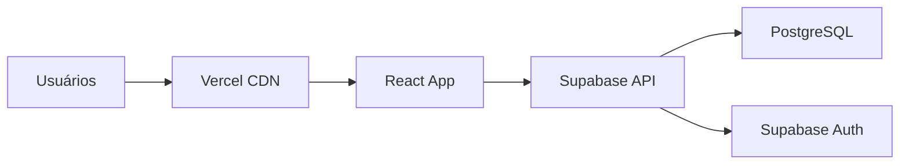

# Guia de Deploy - RegiFlex

Este guia fornece instruções detalhadas para fazer deploy do RegiFlex em produção usando **Supabase** como backend e **Vercel** como plataforma de hospedagem frontend.

---

## 📋 Índice

1. [Visão Geral](#visão-geral)
2. [Pré-requisitos](#pré-requisitos)
3. [Configuração do Supabase](#configuração-do-supabase)
4. [Deploy do Frontend](#deploy-do-frontend)
5. [Configuração de Domínio](#configuração-de-domínio)
6. [Monitoramento](#monitoramento)
7. [Troubleshooting](#troubleshooting)

---

## 🎯 Visão Geral

A arquitetura de deploy do RegiFlex é simples e moderna:



**Componentes:**
- **Frontend:** React.js hospedado na Vercel
- **Backend:** Supabase (gerenciado)
- **Banco de Dados:** PostgreSQL (gerenciado pelo Supabase)
- **Autenticação:** Supabase Auth
- **CDN:** Vercel Edge Network

---

## ✅ Pré-requisitos

### Contas Necessárias

- [ ] **GitHub** - Para versionamento do código
- [ ] **Supabase** - Para backend e banco de dados
- [ ] **Vercel** - Para hospedagem do frontend
- [ ] **Domínio próprio** (opcional)

### Ferramentas Locais

- [ ] **Node.js** 18+ instalado
- [ ] **Git** configurado
- [ ] **npm** ou **yarn**

---

## 🗄️ Configuração do Supabase

### 1. Criar Projeto no Supabase

1. Acesse [supabase.com](https://supabase.com)
2. Clique em **"New Project"**
3. Escolha sua organização
4. Configure o projeto:
   - **Name:** `regiflex-producao`
   - **Database Password:** Gere uma senha forte
   - **Region:** Escolha a região mais próxima dos usuários
5. Clique em **"Create new project"**

### 2. Configurar Banco de Dados

Após o projeto ser criado:

1. Vá para **SQL Editor**
2. Cole e execute o conteúdo do arquivo `database/schema.sql`:

```sql
-- Copie todo o conteúdo de database/schema.sql aqui
-- Exemplo:
CREATE TABLE IF NOT EXISTS usuarios (
    id SERIAL PRIMARY KEY,
    username VARCHAR(80) UNIQUE NOT NULL,
    email VARCHAR(120) UNIQUE NOT NULL,
    password_hash VARCHAR(128) NOT NULL,
    role VARCHAR(20) NOT NULL DEFAULT 'psicologo',
    created_at TIMESTAMP DEFAULT CURRENT_TIMESTAMP
);
-- ... resto do schema
```

### 3. Configurar Row Level Security (RLS)

Execute as políticas de segurança:

```sql
-- Habilitar RLS em todas as tabelas
ALTER TABLE usuarios ENABLE ROW LEVEL SECURITY;
ALTER TABLE pacientes ENABLE ROW LEVEL SECURITY;
ALTER TABLE sessoes ENABLE ROW LEVEL SECURITY;
ALTER TABLE evolucao ENABLE ROW LEVEL SECURITY;
ALTER TABLE logs ENABLE ROW LEVEL SECURITY;

-- Políticas de exemplo (ajuste conforme necessário)
CREATE POLICY "usuarios_policy" ON usuarios
FOR ALL USING (auth.uid() = id::text::uuid);

CREATE POLICY "pacientes_policy" ON pacientes
FOR ALL USING (
  EXISTS (
    SELECT 1 FROM usuarios 
    WHERE usuarios.id::text::uuid = auth.uid()
    AND usuarios.role IN ('admin', 'psicologo')
  )
);
```

### 4. Configurar Autenticação

1. Vá para **Authentication > Settings**
2. Configure **Site URL:** `https://seu-dominio.com`
3. Adicione **Redirect URLs:**
   - `https://seu-dominio.com`
   - `https://seu-dominio.vercel.app`
4. Configure **Email Templates** (opcional)

### 5. Obter Credenciais

1. Vá para **Settings > API**
2. Copie:
   - **Project URL:** `https://xxx.supabase.co`
   - **Public anon key:** `eyJhbGciOiJIUzI1NiIs...`

⚠️ **Importante:** Mantenha essas credenciais seguras!

---

## 🚀 Deploy do Frontend

### Opção 1: Deploy via Vercel (Recomendado)

#### 1.1. Preparar Repositório

```bash
# 1. Certifique-se que o código está no GitHub
git add .
git commit -m "feat: preparar para deploy em produção"
git push origin main
```

#### 1.2. Conectar Vercel ao GitHub

1. Acesse [vercel.com](https://vercel.com)
2. Clique em **"New Project"**
3. Conecte sua conta GitHub
4. Selecione o repositório `RegiFlex-teste`
5. Configure o projeto:
   - **Framework Preset:** Vite
   - **Root Directory:** `.` (ou deixar em branco)
   - **Build Command:** `cd frontend && npm run build`
   - **Output Directory:** `frontend/dist`

#### 1.3. Configurar Variáveis de Ambiente

Na Vercel, vá para **Settings > Environment Variables** e adicione:

```bash
VITE_SUPABASE_URL=https://seu-projeto.supabase.co
VITE_SUPABASE_ANON_KEY=sua-chave-publica-aqui
```

#### 1.4. Deploy

1. Clique em **"Deploy"**
2. Aguarde o build completar
3. Acesse a URL fornecida pela Vercel

#### 1.5. Nota sobre Edge Functions (Importante)

As Edge Functions do Supabase (ex: `predict-no-show`) **não são implantadas pelo Vercel**. Elas devem ser implantadas **separadamente** usando a Supabase CLI. É crucial que este passo seja feito após o deploy do frontend:

```bash
supabase functions deploy
```

### Opção 2: Deploy via Netlify

#### 2.1. Build Local

```bash
cd frontend
npm run build
```

#### 2.2. Deploy Manual

1. Acesse [netlify.com](https://netlify.com)
2. Arraste a pasta `dist` para a área de deploy
3. Configure variáveis de ambiente em **Site Settings > Environment Variables**

### Opção 3: Deploy via GitHub Pages

⚠️ **Limitação:** GitHub Pages não suporta variáveis de ambiente de forma nativa.

```bash
# Instalar gh-pages
npm install --save-dev gh-pages

# Adicionar script no package.json
"scripts": {
  "deploy": "gh-pages -d dist"
}

# Build e deploy
npm run build
npm run deploy
```

---

## 🌐 Configuração de Domínio

### Domínio Personalizado na Vercel

1. Vá para **Settings > Domains**
2. Adicione seu domínio: `regiflex.com.br`
3. Configure DNS no seu provedor:

```
Type: CNAME
Name: www
Value: cname.vercel-dns.com

Type: A
Name: @
Value: 76.76.19.61
```

### SSL/HTTPS

- ✅ **Automático** na Vercel
- ✅ **Certificado Let's Encrypt** renovado automaticamente

---

## 📊 Monitoramento

### Métricas da Vercel

**Analytics Disponíveis:**
- Page views
- Unique visitors
- Top pages
- Top referrers
- Devices e browsers

**Como Acessar:**
1. Dashboard da Vercel
2. Selecione seu projeto
3. Vá para **Analytics**

### Métricas do Supabase

**Dashboard Supabase:**
- Requisições por minuto
- Latência da API
- Uso do banco de dados
- Conexões ativas
- Erros de autenticação

**Como Acessar:**
1. Dashboard do Supabase
2. Selecione seu projeto
3. Vá para **Reports**

### Alertas e Notificações

**Configurar no Supabase:**
1. **Settings > Notifications**
2. Configure alertas para:
   - Alto uso de CPU
   - Muitas conexões
   - Erros de API
   - Quota próxima do limite

---

## 🔧 Configurações Avançadas

### Performance Optimization

#### Frontend (Vercel)

```javascript
// vite.config.js
export default {
  build: {
    rollupOptions: {
      output: {
        manualChunks: {
          vendor: ['react', 'react-dom'],
          supabase: ['@supabase/supabase-js']
        }
      }
    }
  }
}
```

#### Supabase

```sql
-- Índices para performance
CREATE INDEX idx_pacientes_nome ON pacientes(nome_completo);
CREATE INDEX idx_sessoes_data ON sessoes(data_hora);
CREATE INDEX idx_sessoes_paciente ON sessoes(paciente_id);
```

### Backup e Recuperação

**Supabase (Automático):**
- ✅ Backup diário automático
- ✅ Point-in-time recovery
- ✅ Replicação em múltiplas zonas

**Configuração Manual:**
```bash
# Backup via CLI (opcional)
supabase db dump --db-url "postgresql://..." > backup.sql
```

---

## 🚨 Troubleshooting

### Problemas Comuns

#### 1. Build Falha na Vercel

**Erro:** `Module not found: Can't resolve '@supabase/supabase-js'`

**Solução:**
```bash
# Verificar se dependências estão no package.json
cd frontend
npm install @supabase/supabase-js
```

#### 2. Variáveis de Ambiente Não Funcionam

**Erro:** `supabaseUrl is undefined`

**Soluções:**
1. Verificar se variáveis começam com `VITE_`
2. Verificar se estão configuradas na Vercel
3. Fazer redeploy após adicionar variáveis

#### 3. Erro de CORS

**Erro:** `Access to fetch blocked by CORS policy`

**Solução no Supabase:**
1. **Settings > API**
2. **CORS origins:** Adicionar domínio da Vercel

#### 4. Erro de Autenticação

**Erro:** `Invalid login credentials`

**Soluções:**
1. Verificar se RLS está configurado corretamente
2. Verificar se usuário existe na tabela `usuarios`
3. Verificar se Site URL está correto no Supabase

### Logs e Debug

#### Vercel Logs

```bash
# Instalar Vercel CLI
npm i -g vercel

# Ver logs em tempo real
vercel logs seu-projeto.vercel.app
```

#### Supabase Logs

1. Dashboard do Supabase
2. **Logs > API Logs**
3. Filtrar por erro ou endpoint

### Performance Issues

#### Frontend Lento

**Diagnóstico:**
1. Vercel Analytics
2. Chrome DevTools > Lighthouse
3. Web Vitals

**Soluções:**
- Implementar code splitting
- Otimizar imagens
- Usar React.memo para componentes

#### API Lenta

**Diagnóstico:**
1. Supabase Reports
2. Verificar queries lentas

**Soluções:**
- Adicionar índices no banco
- Otimizar queries
- Implementar cache

---

## 🔄 CI/CD (Opcional)

### GitHub Actions

Criar `.github/workflows/deploy.yml`:

```yaml
name: Deploy to Vercel

on:
  push:
    branches: [main]

jobs:
  deploy:
    runs-on: ubuntu-latest
    steps:
      - uses: actions/checkout@v2
      
      - name: Setup Node.js
        uses: actions/setup-node@v2
        with:
          node-version: '18'
          
      - name: Install dependencies
        run: |
          cd frontend
          npm ci
          
      - name: Run tests
        run: |
          cd frontend
          npm test
          
      - name: Deploy to Vercel
        uses: amondnet/vercel-action@v20
        with:
          vercel-token: ${{ secrets.VERCEL_TOKEN }}
          vercel-org-id: ${{ secrets.ORG_ID }}
          vercel-project-id: ${{ secrets.PROJECT_ID }}
          working-directory: frontend
```

---

## 📋 Checklist de Deploy

### Pré-Deploy

- [ ] Código testado localmente
- [ ] Variáveis de ambiente configuradas
- [ ] Schema do banco aplicado
- [ ] RLS configurado
- [ ] Build local funcionando

### Deploy

- [ ] Projeto criado na Vercel
- [ ] Repositório conectado
- [ ] Variáveis de ambiente configuradas
- [ ] Deploy realizado com sucesso
- [ ] Site acessível

### Pós-Deploy

- [ ] Funcionalidades testadas em produção
- [ ] Autenticação funcionando
- [ ] CRUD de pacientes funcionando
- [ ] Monitoramento configurado
- [ ] Backup verificado
- [ ] Domínio personalizado (se aplicável)

---

## 🔮 Próximos Passos

### Melhorias Futuras

1. **CDN para Assets** - Cloudinary ou similar
2. **Monitoring Avançado** - Sentry para error tracking
3. **Analytics** - Google Analytics ou Mixpanel
4. **PWA** - Service Worker para offline
5. **Mobile App** - React Native

### Escalabilidade

- **Supabase Pro** - Para mais recursos e performance
- **Vercel Pro** - Para analytics avançados
- **Edge Functions** - Para lógica serverless
