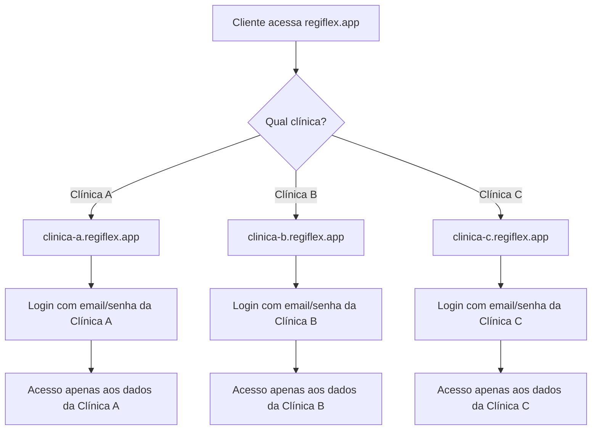

# Gerenciamento de Usuários Multi-Tenant - RegiFlex

**Data:** 2025-10-09  
**Versão:** 2.1.1

---

## 🎯 Como Funciona o Sistema de Usuários Multi-Tenant

O RegiFlex utiliza uma arquitetura **multi-tenant** onde **cada clínica tem seus próprios usuários completamente isolados**, mesmo compartilhando a mesma infraestrutura. Vou explicar como isso funciona na prática.

## 🏗️ Arquitetura de Usuários

### Estrutura do Banco de Dados

```sql
-- Tabela de Clínicas (Tenants)
CREATE TABLE clinicas (
    id UUID PRIMARY KEY DEFAULT gen_random_uuid(),
    nome VARCHAR(255) NOT NULL,
    email VARCHAR(255) UNIQUE NOT NULL,
    subdomain VARCHAR(100) UNIQUE NOT NULL,
    plano VARCHAR(50) NOT NULL,
    status VARCHAR(50) DEFAULT 'active',
    created_at TIMESTAMP DEFAULT NOW()
);

-- Tabela de Usuários (vinculados às clínicas)
CREATE TABLE usuarios (
    id UUID PRIMARY KEY DEFAULT gen_random_uuid(),
    clinic_id UUID REFERENCES clinicas(id) ON DELETE CASCADE,
    auth_user_id UUID REFERENCES auth.users(id) ON DELETE CASCADE,
    nome_completo VARCHAR(255) NOT NULL,
    email VARCHAR(255) NOT NULL,
    role VARCHAR(50) NOT NULL DEFAULT 'user',
    avatar_url TEXT,
    created_at TIMESTAMP DEFAULT NOW(),
    
    UNIQUE(clinic_id, email) -- Email único por clínica
);

-- Supabase Auth (gerencia senhas e autenticação)
-- auth.users (tabela interna do Supabase)
-- - id UUID
-- - email VARCHAR
-- - encrypted_password VARCHAR
-- - email_confirmed_at TIMESTAMP
-- - etc.
```

### Isolamento por Row Level Security (RLS)

```sql
-- Política RLS: Usuários só veem dados da sua clínica
CREATE POLICY "usuarios_isolation" ON usuarios
    FOR ALL USING (
        clinic_id IN (
            SELECT clinic_id FROM usuarios 
            WHERE auth_user_id = auth.uid()
        )
    );

-- Política RLS: Clínicas só veem seus próprios dados
CREATE POLICY "clinicas_isolation" ON clinicas
    FOR ALL USING (
        id IN (
            SELECT clinic_id FROM usuarios 
            WHERE auth_user_id = auth.uid()
        )
    );
```

## 🔐 Processo de Autenticação Multi-Tenant

### 1. Como Cada Cliente Acessa Seu Sistema



### 2. Fluxo de Login Detalhado

```javascript
// 1. Usuário acessa clinica-exemplo.regiflex.app
// 2. Sistema identifica a clínica pelo subdomínio
const clinicSubdomain = window.location.hostname.split('.')[0]; // "clinica-exemplo"

// 3. Login com Supabase Auth
const { data, error } = await supabase.auth.signInWithPassword({
  email: 'admin@clinicaexemplo.com',
  password: 'senha123'
});

// 4. Após login, buscar dados do usuário com clinic_id
const { data: userData } = await supabase
  .from('usuarios')
  .select(`
    *,
    clinicas (
      id,
      nome,
      subdomain,
      plano
    )
  `)
  .eq('auth_user_id', data.user.id)
  .single();

// 5. Verificar se usuário pertence à clínica correta
if (userData.clinicas.subdomain !== clinicSubdomain) {
  throw new Error('Usuário não autorizado para esta clínica');
}

// 6. Definir contexto da sessão
const userContext = {
  user_id: userData.id,
  clinic_id: userData.clinic_id,
  clinic_name: userData.clinicas.nome,
  role: userData.role,
  permissions: getUserPermissions(userData.role)
};
```

## 👥 Gerenciamento de Usuários por Clínica

### Como Criar Usuários para Cada Cliente

#### 1. Processo Automatizado (via n8n)

```javascript
// Workflow n8n: Criar primeiro usuário admin da clínica
async function createClinicAdmin(clinicData) {
  // 1. Criar usuário no Supabase Auth
  const { data: authUser, error: authError } = await supabase.auth.admin.createUser({
    email: clinicData.admin_email,
    password: generateSecurePassword(), // Gera senha temporária
    email_confirm: true,
    user_metadata: {
      clinic_id: clinicData.clinic_id,
      role: 'admin'
    }
  });

  // 2. Criar perfil do usuário
  const { data: userProfile } = await supabase
    .from('usuarios')
    .insert({
      clinic_id: clinicData.clinic_id,
      auth_user_id: authUser.user.id,
      nome_completo: clinicData.admin_name,
      email: clinicData.admin_email,
      role: 'admin'
    })
    .select()
    .single();

  // 3. Enviar email com credenciais
  await sendWelcomeEmail({
    to: clinicData.admin_email,
    clinic_name: clinicData.nome,
    login_url: `https://${clinicData.subdomain}.regiflex.app`,
    temporary_password: password,
    user_name: clinicData.admin_name
  });

  return userProfile;
}
```

#### 2. Interface de Administração

```jsx
// Componente para admin da clínica gerenciar usuários
function UserManagement() {
  const { clinic_id } = useAuth();
  
  const createUser = async (userData) => {
    // 1. Criar no Supabase Auth
    const { data: authUser } = await supabase.auth.admin.createUser({
      email: userData.email,
      password: userData.password,
      email_confirm: true
    });

    // 2. Criar perfil vinculado à clínica
    const { data: userProfile } = await supabase
      .from('usuarios')
      .insert({
        clinic_id: clinic_id, // Automaticamente vincula à clínica do admin
        auth_user_id: authUser.user.id,
        nome_completo: userData.nome,
        email: userData.email,
        role: userData.role
      });

    return userProfile;
  };

  return (
    <div className="user-management">
      <h2>Gerenciar Usuários da Clínica</h2>
      
      {/* Lista usuários da clínica atual */}
      <UserList clinic_id={clinic_id} />
      
      {/* Formulário para criar novo usuário */}
      <CreateUserForm onSubmit={createUser} />
    </div>
  );
}
```

## 🔄 Cenários Práticos de Uso

### Cenário 1: Nova Clínica se Cadastra

```javascript
// 1. Cliente preenche formulário em regiflex.com
const newClinic = {
  nome: "Clínica Bem Estar",
  email: "contato@clinicabemestar.com",
  admin_name: "Dr. João Silva",
  admin_email: "joao@clinicabemestar.com",
  plano: "individual"
};

// 2. n8n processa automaticamente
const result = await processNewClinic(newClinic);
// - Cria clínica no banco
// - Gera subdomain: "clinica-bem-estar"
// - Cria usuário admin
// - Envia credenciais por email
// - Deploy da instância personalizada

// 3. Dr. João recebe email:
/*
Olá Dr. João Silva!

Sua clínica "Clínica Bem Estar" foi configurada com sucesso!

🔗 Acesse em: https://clinica-bem-estar.regiflex.app
📧 Email: joao@clinicabemestar.com
🔑 Senha temporária: TempPass123!

Por favor, altere sua senha no primeiro acesso.
*/
```

### Cenário 2: Admin Adiciona Novos Usuários

```javascript
// Dr. João (admin) quer adicionar uma psicóloga
const newUser = {
  nome: "Dra. Maria Santos",
  email: "maria@clinicabemestar.com",
  role: "psicologo",
  password: "SenhaSegura456!"
};

// Sistema automaticamente:
// 1. Cria usuário no Supabase Auth
// 2. Vincula à clínica do Dr. João (clinic_id)
// 3. Define permissões baseadas no role
// 4. Envia email de boas-vindas para Dra. Maria
```

### Cenário 3: Usuário Faz Login

```javascript
// Dra. Maria acessa https://clinica-bem-estar.regiflex.app
// 1. Insere credenciais
const loginData = {
  email: "maria@clinicabemestar.com",
  password: "SenhaSegura456!"
};

// 2. Sistema valida e carrega contexto
const session = await authenticateUser(loginData);
// session = {
//   user: { id: "uuid", nome: "Dra. Maria Santos" },
//   clinic: { id: "uuid", nome: "Clínica Bem Estar" },
//   permissions: ["view_patients", "create_sessions", "edit_own_data"]
// }

// 3. Dra. Maria só vê pacientes da Clínica Bem Estar
// 4. Não consegue acessar dados de outras clínicas
```

## 🛡️ Segurança e Isolamento

### Garantias de Segurança

#### 1. Isolamento de Dados
```sql
-- Exemplo: Dra. Maria tenta ver todos os pacientes
SELECT * FROM pacientes;

-- RLS automaticamente transforma em:
SELECT * FROM pacientes 
WHERE clinic_id = 'clinic-id-da-dra-maria';

-- Resultado: Só vê pacientes da Clínica Bem Estar
```

#### 2. Prevenção de Cross-Tenant Access
```javascript
// Tentativa de acesso malicioso
const maliciousAttempt = await supabase
  .from('pacientes')
  .select('*')
  .eq('clinic_id', 'outra-clinica-id'); // Tentando acessar outra clínica

// Resultado: [] (array vazio)
// RLS bloqueia automaticamente
```

#### 3. Validação de Subdomínio
```javascript
// Middleware de validação
function validateClinicAccess(req, res, next) {
  const subdomain = req.hostname.split('.')[0];
  const userClinic = req.user.clinic.subdomain;
  
  if (subdomain !== userClinic) {
    return res.status(403).json({ 
      error: 'Acesso negado: usuário não pertence a esta clínica' 
    });
  }
  
  next();
}
```

## 🔧 Implementação Prática

### 1. Configuração do Frontend

```jsx
// Context para gerenciar multi-tenancy
const ClinicContext = createContext();

export function ClinicProvider({ children }) {
  const [clinic, setClinic] = useState(null);
  const [user, setUser] = useState(null);
  
  useEffect(() => {
    // Identificar clínica pelo subdomínio
    const subdomain = window.location.hostname.split('.')[0];
    
    // Carregar dados da clínica
    loadClinicData(subdomain).then(setClinic);
  }, []);
  
  const login = async (email, password) => {
    // 1. Autenticar com Supabase
    const { data } = await supabase.auth.signInWithPassword({
      email, password
    });
    
    // 2. Carregar perfil do usuário
    const userProfile = await loadUserProfile(data.user.id);
    
    // 3. Validar se pertence à clínica
    if (userProfile.clinic.subdomain !== clinic.subdomain) {
      throw new Error('Usuário não autorizado');
    }
    
    setUser(userProfile);
  };
  
  return (
    <ClinicContext.Provider value={{ clinic, user, login }}>
      {children}
    </ClinicContext.Provider>
  );
}
```

### 2. Hook para Usar o Contexto

```jsx
// Hook personalizado
export function useClinic() {
  const context = useContext(ClinicContext);
  
  if (!context) {
    throw new Error('useClinic deve ser usado dentro de ClinicProvider');
  }
  
  return context;
}

// Uso nos componentes
function PatientsList() {
  const { clinic, user } = useClinic();
  
  // Automaticamente filtra por clinic_id
  const { data: patients } = useQuery(['patients'], () =>
    supabase
      .from('pacientes')
      .select('*')
      // RLS garante que só vê pacientes da clínica
  );
  
  return (
    <div>
      <h2>Pacientes - {clinic.nome}</h2>
      {patients?.map(patient => (
        <PatientCard key={patient.id} patient={patient} />
      ))}
    </div>
  );
}
```

## 📋 Tipos de Usuários e Permissões

### Hierarquia de Usuários por Clínica

```javascript
const USER_ROLES = {
  'super_admin': {
    name: 'Super Administrador',
    permissions: ['*'], // Todas as permissões
    description: 'Acesso total ao sistema da clínica'
  },
  'admin': {
    name: 'Administrador',
    permissions: [
      'manage_users',
      'manage_clinic_settings',
      'view_all_patients',
      'view_all_sessions',
      'manage_billing',
      'view_reports'
    ],
    description: 'Gerencia a clínica e usuários'
  },
  'psicologo': {
    name: 'Psicólogo',
    permissions: [
      'view_own_patients',
      'create_patients',
      'edit_own_patients',
      'create_sessions',
      'edit_own_sessions',
      'view_own_reports'
    ],
    description: 'Gerencia seus próprios pacientes e sessões'
  },
  'recepcionista': {
    name: 'Recepcionista',
    permissions: [
      'view_patients',
      'create_patients',
      'edit_patient_contact',
      'schedule_sessions',
      'view_schedule'
    ],
    description: 'Gerencia agendamentos e cadastros básicos'
  },
  'estagiario': {
    name: 'Estagiário',
    permissions: [
      'view_assigned_patients',
      'create_session_notes',
      'view_own_schedule'
    ],
    description: 'Acesso limitado sob supervisão'
  }
};
```

### Sistema de Permissões

```javascript
// Middleware de permissões
function requirePermission(permission) {
  return (req, res, next) => {
    const userPermissions = getUserPermissions(req.user.role);
    
    if (!userPermissions.includes(permission) && !userPermissions.includes('*')) {
      return res.status(403).json({
        error: 'Permissão insuficiente',
        required: permission,
        user_role: req.user.role
      });
    }
    
    next();
  };
}

// Uso nas rotas
app.get('/api/patients', 
  authenticateUser,
  requirePermission('view_patients'),
  getPatients
);

app.post('/api/users',
  authenticateUser, 
  requirePermission('manage_users'),
  createUser
);
```

## 🚀 Automação com n8n

### Workflow: Criar Usuário Automaticamente

```javascript
// n8n workflow para criar usuários
{
  "name": "RegiFlex - Criar Usuário",
  "trigger": "webhook",
  "steps": [
    {
      "name": "Validar Dados",
      "code": `
        const { clinic_id, nome, email, role, created_by } = items[0].json;
        
        // Validar se quem está criando tem permissão
        const creator = await getUser(created_by);
        if (!hasPermission(creator.role, 'manage_users')) {
          throw new Error('Sem permissão para criar usuários');
        }
        
        return [{ json: { clinic_id, nome, email, role } }];
      `
    },
    {
      "name": "Criar no Supabase Auth",
      "http_request": {
        "url": "${SUPABASE_URL}/auth/v1/admin/users",
        "method": "POST",
        "headers": {
          "Authorization": "Bearer ${SUPABASE_SERVICE_KEY}"
        },
        "body": {
          "email": "={{$json.email}}",
          "password": "={{generatePassword()}}",
          "email_confirm": true
        }
      }
    },
    {
      "name": "Criar Perfil",
      "http_request": {
        "url": "${SUPABASE_URL}/rest/v1/usuarios",
        "method": "POST",
        "body": {
          "clinic_id": "={{$json.clinic_id}}",
          "auth_user_id": "={{$node['Criar no Supabase Auth'].json.user.id}}",
          "nome_completo": "={{$json.nome}}",
          "email": "={{$json.email}}",
          "role": "={{$json.role}}"
        }
      }
    },
    {
      "name": "Enviar Email Credenciais",
      "email": {
        "to": "={{$json.email}}",
        "subject": "Bem-vindo ao RegiFlex!",
        "body": "Suas credenciais de acesso foram criadas..."
      }
    }
  ]
}
```

## 📊 Monitoramento e Auditoria

### Log de Atividades por Clínica

```sql
-- Tabela de auditoria
CREATE TABLE audit_logs (
    id UUID PRIMARY KEY DEFAULT gen_random_uuid(),
    clinic_id UUID REFERENCES clinicas(id),
    user_id UUID REFERENCES usuarios(id),
    action VARCHAR(100) NOT NULL,
    resource_type VARCHAR(50),
    resource_id UUID,
    details JSONB,
    ip_address INET,
    user_agent TEXT,
    created_at TIMESTAMP DEFAULT NOW()
);

-- RLS para logs (cada clínica só vê seus logs)
CREATE POLICY "audit_logs_isolation" ON audit_logs
    FOR ALL USING (
        clinic_id IN (
            SELECT clinic_id FROM usuarios 
            WHERE auth_user_id = auth.uid()
        )
    );
```

### Dashboard de Usuários por Clínica

```jsx
function UserDashboard() {
  const { clinic } = useClinic();
  
  const stats = useQuery(['user-stats'], () =>
    supabase
      .from('usuarios')
      .select('role')
      .eq('clinic_id', clinic.id)
  );
  
  const usersByRole = stats.data?.reduce((acc, user) => {
    acc[user.role] = (acc[user.role] || 0) + 1;
    return acc;
  }, {});
  
  return (
    <div className="user-dashboard">
      <h2>Usuários da {clinic.nome}</h2>
      
      <div className="stats-grid">
        <StatCard 
          title="Administradores" 
          value={usersByRole?.admin || 0}
          icon="👑"
        />
        <StatCard 
          title="Psicólogos" 
          value={usersByRole?.psicologo || 0}
          icon="🧠"
        />
        <StatCard 
          title="Recepcionistas" 
          value={usersByRole?.recepcionista || 0}
          icon="📞"
        />
        <StatCard 
          title="Estagiários" 
          value={usersByRole?.estagiario || 0}
          icon="🎓"
        />
      </div>
    </div>
  );
}
```

## 🔮 Funcionalidades Avançadas

### 1. Convite por Email

```javascript
// Sistema de convites
async function inviteUser(inviteData) {
  // 1. Gerar token de convite
  const inviteToken = generateSecureToken();
  
  // 2. Salvar convite pendente
  await supabase
    .from('user_invites')
    .insert({
      clinic_id: inviteData.clinic_id,
      email: inviteData.email,
      role: inviteData.role,
      invited_by: inviteData.invited_by,
      token: inviteToken,
      expires_at: new Date(Date.now() + 7 * 24 * 60 * 60 * 1000) // 7 dias
    });
  
  // 3. Enviar email de convite
  await sendInviteEmail({
    to: inviteData.email,
    clinic_name: inviteData.clinic_name,
    invite_url: `https://${inviteData.subdomain}.regiflex.app/accept-invite/${inviteToken}`,
    role: inviteData.role
  });
}
```

### 2. Troca de Senha Forçada

```javascript
// Forçar troca de senha no primeiro login
function FirstLoginModal({ user, onPasswordChanged }) {
  const [newPassword, setNewPassword] = useState('');
  
  const changePassword = async () => {
    // 1. Atualizar senha no Supabase Auth
    await supabase.auth.updateUser({
      password: newPassword
    });
    
    // 2. Marcar como senha alterada
    await supabase
      .from('usuarios')
      .update({ password_changed: true })
      .eq('id', user.id);
    
    onPasswordChanged();
  };
  
  return (
    <Modal title="Primeira vez? Altere sua senha">
      <p>Por segurança, altere sua senha temporária.</p>
      <PasswordInput 
        value={newPassword}
        onChange={setNewPassword}
        strength={true}
      />
      <Button onClick={changePassword}>
        Alterar Senha
      </Button>
    </Modal>
  );
}
```

## 📝 Resumo Final

### Como Funciona na Prática:

1. **Cada clínica é completamente isolada**
2. **Usuários são criados por clínica** (não globalmente)
3. **Senhas são gerenciadas pelo Supabase Auth**
4. **RLS garante que dados não se misturam**
5. **Subdomínios identificam a clínica**
6. **Permissões são por role dentro da clínica**

### Para Trocar Usuário/Senha:

1. **Admin da clínica** acessa painel de usuários
2. **Cria/edita usuários** da sua clínica
3. **Define roles e permissões**
4. **Sistema envia credenciais** automaticamente
5. **Usuário faz primeiro login** e troca senha

**Resultado:** Cada clínica gerencia seus próprios usuários de forma completamente independente, com segurança total! 🔐
