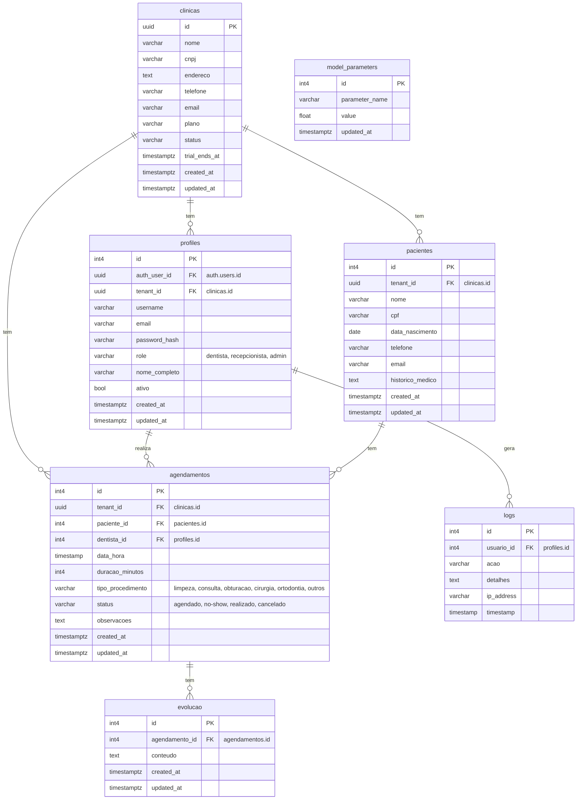

# Diagrama de Relacionamento de Entidades (ERD) - Regiflex Odontologia

Este diagrama reflete a estrutura do banco de dados Supabase para o projeto Regiflex Odontologia, incorporando a arquitetura multi-tenant e as adaptações do modelo de psicologia.

## Adaptações Chave:
- **`psicologo`** foi substituído por **`dentista`** (representado na tabela `profiles`).
- **`sessoes`** foi renomeado para **`agendamentos`**.
- Implementação de **`tenant_id`** (UUID) em todas as tabelas principais para isolamento multi-tenant.

## Estrutura do Banco de Dados

